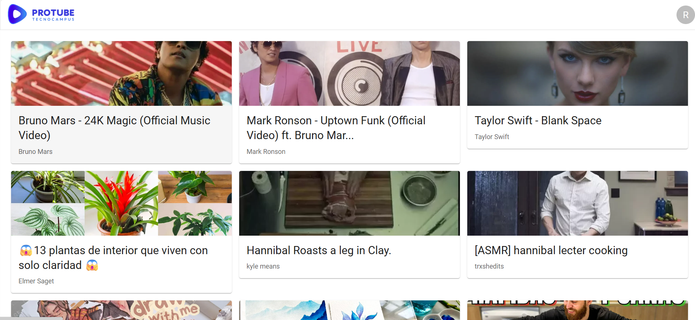
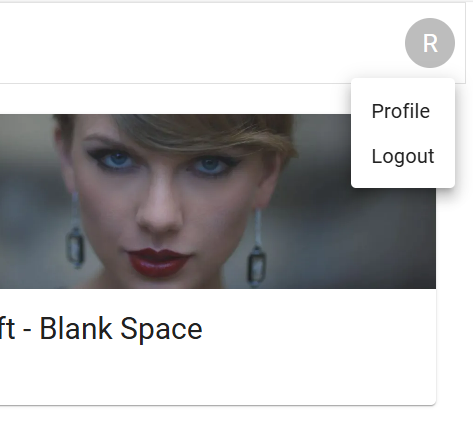
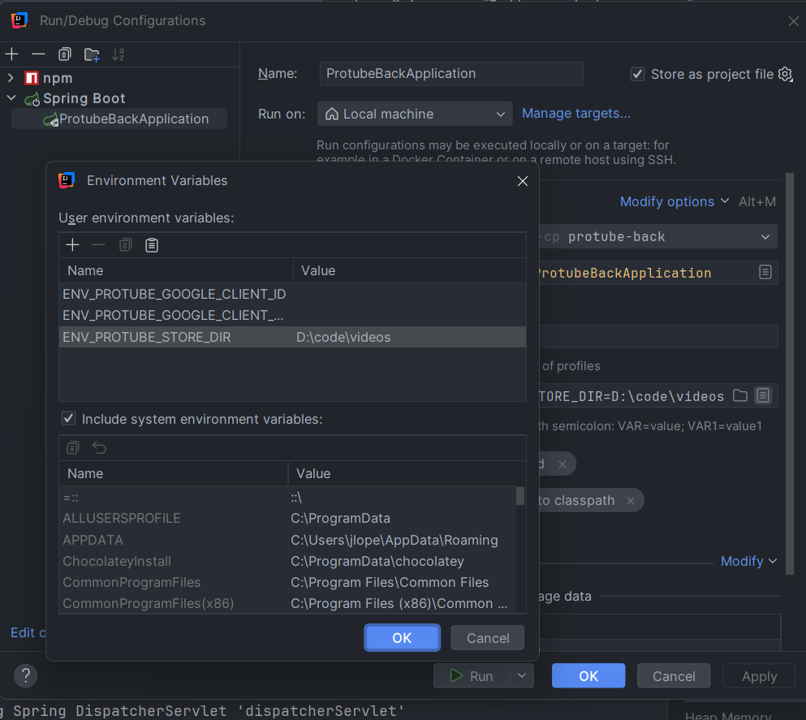
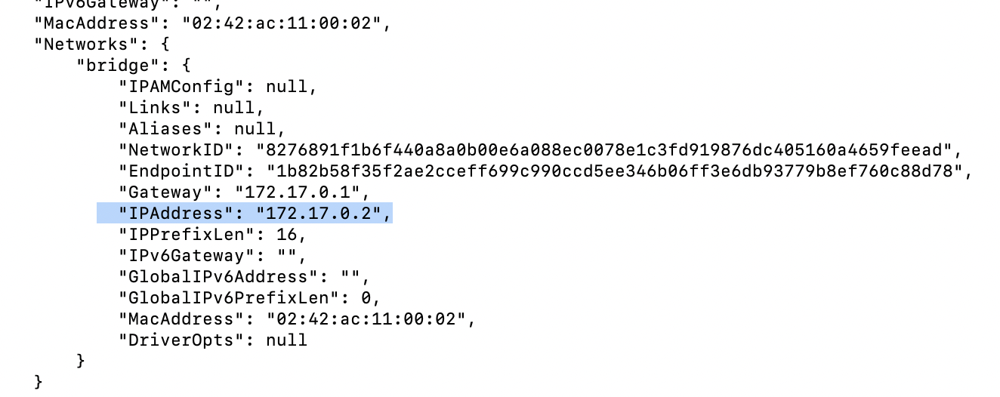

# Pro tube project

## Project
The project consists of building a web application where the user can watch and comment videos uploaded by themselves and other registered users.

### Goals

The goal of this exercise is to reproduce as much as we can a REAL work environment.
Creating a defined project from scratch using Agile methodologies to develop it.

### Teams

You have to create a groups of 3-4 people to develop the project. It depends on the team, but the main idea is to have
at least one people in charge of the definition of the features (Product owner/manager).

### Evaluation

The evaluation of the subject depended on 2 parts:

* **70%** Practical (Delivery of the project)
* **30%** Exam (Will be an exam asking about your delivery, how you implemented something, plant the integration of a new feature –how do
  you structure–, etc.)

>
> # ⚠️
> Even the project have to be done in teams the evaluation will be individual and will follow a continuous evaluation.
>
⚠️ The minimum qualification in the two parts to approve the subject will be 3. In case Exam is not pass with more than 3
the student has right to a Recovery exam.

### Code contribution

* All the contribution will be done by Pull Request leaving main branch locked of commit directly.
* The pull request have to be reviewed for some other members of the team and approved **AT LEAST** by one people.
* Commits should be a definition of the changes done. And should contain a reference of the task. P.e
  using [convention commits](https://www.conventionalcommits.org/en/v1.0.0/#summary)
* How to [set up a project](./docs/GITHUB_SETUP.md) following Best practises

### Agile

Each team is responsible for selecting the agile framework that best fits their workflow. Adherence to agile methodologies is essential, including the definition and execution of ceremonies such as Daily Standups, Refinement/Grooming, Retrospectives, Demos, and others as appropriate.
#### Agile ceremonies

| Name                | Description                                                                                                                                                                                                                                                   | Duration                                   | Frequency                          | Outcome                                                                                                                      |
|---------------------|---------------------------------------------------------------------------------------------------------------------------------------------------------------------------------------------------------------------------------------------------------------|--------------------------------------------|------------------------------------|------------------------------------------------------------------------------------------------------------------------------|
| Daily               | Report of the current status of the sprint                                                                                                                                                                                                                    | 10min                                      | Every day                          | In this ceremony the team have to talk about the work, detect some possible blockers and check the status of the sprint goal |
| Retrospective       | Meeting to look back of the previous sprint and detect strengths and weakness                                                                                                                                                                                 | 1h                                         | At the end of the Sprint           | The outcome of the retrospective is to create Actions point to be tackled in the following sprints                           |
| Refinement/Grooming | In this meeting the them have to talk about future coming stories, detect potential issues or dependencies and do an estimation of every task                                                                                                                 | 1h                                         | Once a week/sprint                 | Task with all the requirements discussed for every task and also an estimation of effort of the task                         |
| Demo/Sprint review  | This meeting is for the stakeholders of the project and the team has to show the new features introduced in the sprint                                                                                                                                        | 30min max                                  | At the end of the sprint           | Retrieve feedback from stakeholders                                                                                          |
| Post mortem         | On demand meeting that consist on analyze Critical issues that happened in the past.                                                                                                                                                                          | Depending on the # of task to be discussed | On demand at the end of the sprint | The outcome is to create Action Points to prevent that the analyzed issue in the future                                      |
| Planning            | This is the closing sprint ceremony. All the non-finished tasks will be moved to the following sprint. Also the team decide the effort capacity that will have for the next sprint and according the capacity will decide the task tackled in the next sprint | 30min                                      | On demand at the end of the sprint | The work to do in the next sprint                                                                                            |

### MVP

The MVP consist in create a basic web with the following features:

* EVALUATION (5)
* Authentication (Basic Register/login, etc.)
* View list of videos (using videos generated by `videoGrabber` tool)
* Play a video and show information about the video (title, description, comments, etc.)
* Presentations of the progress on sprint reviews/demo
* **EVERYTHING** has to be well tested and have more than 50% of coverage

#### Example of sprint review/demo

* Wha we commited to do
  * A list of task the team commited before start the sprint
* What we finally did
  * A list of task the team finally did
* Demo of the new features
  * Presentation of the PRODUCT. THe presentation is focused on the product. How it works, etc.
* What went well
* Problems found
  * Explanation what the team found during the sprint
  * How the team solved it
  * Explanation why the team does not finish all the tasks commited
* Next steps
  * A list of task the team want to do in the next sprint

#### Example of MVP

Below you can find some examples of the new feature. 
Home page example



Video player example


Authentication example



### Improvements
To increase the evaluation you have to add more features to the MVP. The more features you add the more evaluation you will
get. The maximum evaluation is 10.
The group will be free to decide which feature want to add.
Another way to increase the evaluation is to improve the quality of the code, architecture, etc. Using toolings such as
SonarQube, ESLint, creating a good CI/CD pipeline (Github Actions), E2E tests, etc.
We list a set of potential improvement BUT every team can decided others by themselves.
Depending on the complexity of the feature the evaluation will increase more or less.

**Product:**
* Authentication with OAuth or other similar system
* Rating videos
* Mobile/Responsiveness
* Searcher
    * Using current DB
    * Using cached system such as Rabbit, Elastic
* Video metadata editor (tags, description, category, etc.)
* Favorite videos
* User profile (avatar, description, etc.)
* Upload videos
* Subscriptions to other users
* Comments (replies, likes, etc.)
* Dark mode
* Internationalization (i18n)
* Accessibility (a11y)

**Engineering:**
* CI/CD pipeline (Github Actions, Jenkins, etc.)
* Code quality toolings (SonarQube, ESLint, etc.)
* E2E tests (Cypress, Selenium, etc.)
* More than 90% of test coverage
* Add Database
* Use Static server to save resources (Cloudinary, AWS S3, etc.)
* Use of caching system (Redis, Memcached, etc.)
* Use of containerization (Docker, Kubernetes, etc.)
* Use of design patterns
* Documentation (Swagger, JSDocs etc.)
* Use of microservices architecture
* Deploy app

**Agile:**
* Keeping all ceremonies on every sprint
* Use of Gitflow or other similar branching model
* Use of Jira, Trello or other similar tool to manage the project
* Use of Confluence or other similar tool to document the project
* Use of Slack or other similar tool to communicate the team
* Use of Miro or other similar tool to create diagrams, flowcharts, etc.
* Use of Figma or other similar tool to create mockups, wireframes, etc.
* Creating a good backlog with user stories, tasks, etc.

**Other:**
*  ⚠️ Any other kind of improvement the team decide have to be discussed with the professor before start working on it.


## Tech requirement

Before starting coding you have to be sure you have the following software already installed:

### Backend

* Java 21 ([correto](https://docs.aws.amazon.com/corretto/latest/corretto-21-ug/downloads-list.html) recommended)
* [Maven](https://maven.apache.org/index.html) 3.9x

### Frontend

* [Node 22](https://nodejs.org/en/download) (Latest LTS version)
* [npm 9x](https://www.npmjs.com/get-npm) (Latest LTS version)

### Database

* By default, [h2 database](https://h2database.com/html/main.html) is used but in case group decide to user a real database Postgres should be installed in the machine.

### Video grabber
* Python 3x 
  * On Linux / Windows with WSL
    ```commandline
    sudo apt-get update
    sudo apt-get install python3 python3-pip
    ```
  * On macOS: Use Homebrew to install Python:
    ```commandline
    brew install python
    ```
  * On Windows: Download the Python [installer](https://www.python.org/downloads/windows/) from the official Python website. Run the installer and ensure that you check the option to add Python to your system’s PATH during the installation process.

* yt-dlp 
  * On Linux / Windows with WSL
    * ```commandline
      sudo wget https://github.com/yt-dlp/yt-dlp/releases/latest/download/yt-dlp -O /usr/local/bin/yt-dlp
      // And after:
      sudo chmod a+rx /usr/local/bin/yt-dlp
      ```
    * On mac
      ```commandline
      brew install yt-dlp
      ```
* ffmpeg
    * On Windows: Download the ffmpeg [executable](https://ffmpeg.org/download.html) from FFmpeg’s official website. Extract the files and add the bin
      directory to your system’s PATH.
    * On macOS: Use Homebrew to install ffmpeg:
      ```commandline
      brew install ffmpeg
      ```
    * On Linux:  On Linux / Windows with WSL Install ffmpeg using your package manager. For example, on Ubuntu:
      ```commandline
        sudo apt-get update
        sudo apt-get install ffmpeg
      ```
      
Remember to remove this packages in case you don't want after the project you can execute the following command
```commandline
sudo apt-get remove package // (yt-dlp or ffmpeg)
```

## Backend
Run `ProtubeBackApplication` from the menu on the top right of Intellij IDEA. Before you should add the ENVIRONMENT VARIABLE for the folder where the videos are located.




For Environment variables (if you don't see select it from Modify Options menu)

```
ENV_PROTUBE_STORE_DIR={stored-folder-absolute-path}
```


## Frontend

Navigate in a terminal to `frontend` folder and run the following command to install dependencies

```bash
npm install
```
Once dependencies are installed properly run the following code to execute the application in `dev` mode

```bash
npm run dev
```

This command above will open a port 5173 where you can access from the browser.

For run the tests

```bash
npm run test
```

## Tooling

### Video grabber

#### Installation
First step is to have configured a WSL in your Windows Machine. In case you use unix-like system (linux or mac) you can follow sim

This script here help you to generate a default content for the web.

Once you have resolved the dependencies explained above you can run the following command inside `tooling/videoGrabber`
folder.

```commandline
python3 main.py --store={Store_Folder} --id=10 --recreate --videos={Path to video_list.txt}
```

Explanation of the parameters:

| Attribute | Type                           | Description                                                                                                     | Example                                                       |
|-----------|--------------------------------|-----------------------------------------------------------------------------------------------------------------|---------------------------------------------------------------|
| id        | integer                        | Number to seed random                                                                                           | `--id=2`                                                      |
| store     | string (path to local machine) | Folder where videos download will be downloaded                                                                 | `--store=/usr/user/home/videos`                               |
| recreate  | boolean                        | Do overwrite of the store folder                                                                                | `--recreate` or `--recreate=False`                            |
| videos    | string (path to local machine  | Path where videos list is saved. there is a default videos inside `resources` folder. But it can be overwritten | `--videos=/src/user/home/LS-protube/resources/video_list.txt` |

The command will generate 3 files per every video disposed in `resources/video_list.txt`

* *.mp4: The video cutted
* *.webp: The thumbnail
* *.json: Metadata info about the video

## Set database

### Instruction using Docker

* Download docker image
  ```commandline
  docker pull postgres
  ```
* Create container
  ```commandline
  docker run --name postgres-dev -p 5432:5432/tcp -h 127.0.0.1 -e POSTGRES_USER=root -e POSTGRES_PASSWORD=secret -e PGDATA=/var/lib/postgresql/data/pgdata -e POSTGRES_INITDB_ARGS--auth-host=scram-sha-256 -v /Users/jordi.lopez/docker-postgres:/var/lib/postgresql/data -d postgres:latest
  ```
* Once you have created you can start it using
  ```commandline
  docker start postgres-dev
  ```
* Now let's install an Admin page
  ```commandline
  docker pull dpage/pgadmin4
  ```
* Set container for Postgres Admin
  ```commandline
  docker run -e PGADMIN_DEFAULT_EMAIL={YOUREMAIL} -e PGADMIN_DEFAULT_PASSWORD=test1234 -e PGADMIN_CONFIG_WTF_CSRF_ENABLED=False -p 8888:80 --name pgadmin4-dev dpage/pgadmin4
  ```
* Once you have created it, you can start it using:
  ```commandline
  docker start dpage/pgadmin4
  ```
* Retrieve the internal IP address:
  ```commandline
  docker inspect pgadmin4-dev
  ```
  
